# Art and tone

## Agreed direction

Stylized, slightly grimy visuals with dark humor and eccentric characters. The user likes Schedule I's minimalist, simple cartoon appearance. First-person exploration is selected.

The intended play experience is approachable even when systems are complex. A grimy setting and conflict can coexist with familiar routines. Presentation must make active deadlines, suspicion, and disruptions immediately understandable.

The usual atmosphere of the lighting and interiors should feel **"eerily cozy/comfy"**, in the user's words. This applies in most cases, beyond the occasional dramatic lighting accents. The place should still feel like a prison. The specific visual treatment needs testing in the running scene.

### Reference-board decisions - agreed

- **Characters:** proportions close to the Schedule I reference, with funny, cute faces. Create original character designs rather than directly copying its faces. Exact head shapes, eye shapes, noses, and expressions remain to be designed and reviewed.
- **Character exploration (September 24):** the user initially requested the "stick figure sort of design" they liked in Schedule I after finding V1/V2 too detailed. They subsequently returned to V2 to compare different cartoon visual styles and clarified that their word "animation" meant visual style, not movement. Simple production remains a goal; the exact style and anatomy are open while these alternatives are reviewed.
- **Latest scope clarification:** use Schedule I's simplicity as a starting point, but create a unique appearance through several mixtures of other games' visual approaches. The user explicitly does not want the result to literally look like Schedule I. Show one or two actual Schedule I character images and real examples of the other references. Specific mixtures and styles remain proposed.
- **Surface detail:** the level shown in Schedule I is sufficient. Keep the production effort practical; the user does not want time spent adding extensive individual surface details.
- **Character style selected (September 24):** after reviewing the revised M5-M8 sheet, the user said "ok lets go with this". Adopt this rounded/minimal visual direction, including M7's connected brow, white eyes with dark pupils, and small mouth applied to M5/M6. Preserve the range of head/body shapes. The user did not single out M5 versus M6 as the first inmate; that production choice remains open. This approves the concept direction, not an unseen 3D result.
- **Lighting accents:** occasional dramatic, coloured lighting is welcome because the user finds it cozy and comfy. Preserve that feeling alongside clear interaction feedback.
- **ART-02 lighting choice (September 24):** warm amber from A for the cell; softer cream and cool blue-grey from B for corridors and common areas. The user said each feels really good in those respective spaces. This combination is agreed and now implemented in `Art02_Combined`; user review of the combined transition and in-play readability remains. This does not approve final assets or establish an outdoor lighting treatment.
- **Everyday prison interior:** the user accepted the combination: an open common area connected to more enclosed corridors, using B1/B2 in the [reference board](art-reference-board.md). Exact ceiling heights, daylight exposure, colours, and fixture placement remain to be tested; this choice does not adopt every detail of either photograph.

## Sound direction - agreed mood, proposed first palette

The user authorized sourcing commercially usable sound effects and requested "comfy/cozy" and "sort of umami" sound. Working interpretation: warm, tactile and satisfying, with soft transients and restrained volume. That interpretation and the specific mix still need listening review.

The first implemented palette uses quiet concrete steps, paper rustles for handling/wrapping, rounded ingredient/placement taps, a muted metal door clunk, a subtle sale pluck and low room tone. It does not introduce music, voice lines or alarm sounds. Gameplay rules emit successful-action cues; a local audio component renders them. Effects and ambience have separate volume sliders and pause with settings/focus loss. Loading clears old effects rather than replaying actions.

Sources, permissions and exact edits are recorded in the [asset register](asset-register.md). All selected sources are CC0. Technical verification and listening-review status belong in [Progress](progress.md).

## Visual proposals

- Develop original variations within the agreed exaggerated, funny/cute character direction: head silhouette, eyes, brows, nose, hair, and posture.
- Use a small reusable set of materials/textures for painted walls, metal, wood, and fabric to achieve the agreed surface-detail level. Existing suitable textures and shared wear patterns can reduce manual work; material selection, setup, and in-game checks are still required. The asset source and authoring tools remain open.
- Recognizable faces, postures, voices, and personal possessions for important characters.
- Consistent institutional architecture, with personal touches in cells and social spaces.
- Lighting and color that help players distinguish locations and notice usable objects.

Muted walls, faded uniforms, institutional signage, and occasional bright personal objects are a palette candidate. Exact colors, proportions, and rendering choices remain open.

Reusable character bodies and modular rooms are production proposals. Important inmates need enough variation to be recognizable during ordinary play.

### First atmosphere test - proposed execution

Test the agreed "eerily cozy/comfy" feeling in one cell corner, the adjoining enclosed corridor, and a view into the open common area. Begin with existing geometry and a few reusable materials so lighting can be judged before detailed asset production.

- Try soft warm light around the bunk or personal objects, with cooler or muted light in the corridor and common area.
- Use gentle falloff into shadow, while keeping faces, doors, and interaction targets legible from the player camera.
- Let bars, doors, worn institutional surfaces, and the enclosed corridor retain the sense of confinement. A few personal belongings can contribute comfort.
- Compare two lighting treatments of the same small space. Keep camera position and geometry consistent so the differences are easy to judge.

These are proposed ways to produce the mood, not newly agreed palette or fixture decisions. Success requires the user's judgment that ordinary time spent there feels both comfortable and subtly unsettling, with readable gameplay. After that, develop one original funny/cute inmate and review it under the chosen light; no final character design is selected yet.

### ART-02 review samples — proposed

Implemented September 24 for comparison. The user selected A's warm amber for the cell and B's softer cream/cool blue-grey for corridors and common areas. The individual scenes below remain the original comparison samples. `Assets/Scenes/Art02_Combined.unity` applies the selected combination, with B's ambient fill shared across the scene and local lights producing the warm/cool transition. These are lighting and flat-material studies on the rough room, not finished artwork. Both use identical geometry, added ceilings, fixtures, and simple bedding/book props.

| Treatment | Cell | Corridor toward common area | Common area |
| --- | --- | --- | --- |
| A: amber cell and common lights, muted green corridor | [Cell A](images/art02/A_Amber-cell.png) | [Corridor A](images/art02/A_Amber-corridor.png) | [Common A](images/art02/A_Amber-common.png) |
| B: cream cell light, cooler blue-grey corridor and common area | [Cell B](images/art02/B_SoftCool-cell.png) | [Corridor B](images/art02/B_SoftCool-corridor.png) | [Common B](images/art02/B_SoftCool-common.png) |
| Selected combination: amber cell, cooler shared areas | [Combined cell](images/art02/Combined-cell.png) | [Combined doorway](images/art02/Combined-corridor.png) | [Combined common area](images/art02/Combined-common.png) |

In Unity, open `Assets/Scenes/Art02_A_Amber.unity` or `Art02_B_SoftCool.unity`, press Play, select Game, and click **Resume walking**. WASD/mouse move and look; E operates the door/pickup/inmate; Q places the parcel; Escape releases the mouse. Stop Play before opening the other scene. The existing Windows executable still contains the original room.

Open `Assets/Scenes/Art02_Combined.unity` to review the selected combination. Its movement and interaction checks passed; review the transition and visibility of doors, parcel, inmate, and prompts while walking. The placeholder inmate has no finished face; face readability needs another review during ART-03. Technical evidence lives in [Progress](progress.md#art-02-atmosphere-comparison--september-24).

### ART-03 production workflow - proposed

Start with a small concept sheet of original funny/cute head and body variations for user selection. Build a simple 3D version of the chosen design and test it in Unity early to judge proportions, expression, and readability at conversation distance under both selected lighting conditions. Refine materials, add a skeleton and its influence on the body, then test a small set of idle/walking/talking motions. M5 now has native Unity meshes, a skeleton, skin weights and three preview clips. Appearance and motion remain subject to user review. Blender remains a candidate for further modeling and animation, not an established export workflow.

### ART-03 current exploration - twelve original style mixtures

**Selected style:** the user accepted the revised sheet below with "ok lets go with this". It establishes the rounded/minimal M5-M8 direction, with M7's heavy connected brow, white eyes with black pupils, and small mouth on M5/M6. M5 and M6 retain their different head/body shapes. No single first inmate was specified, and a 3D implementation still needs review in the game.

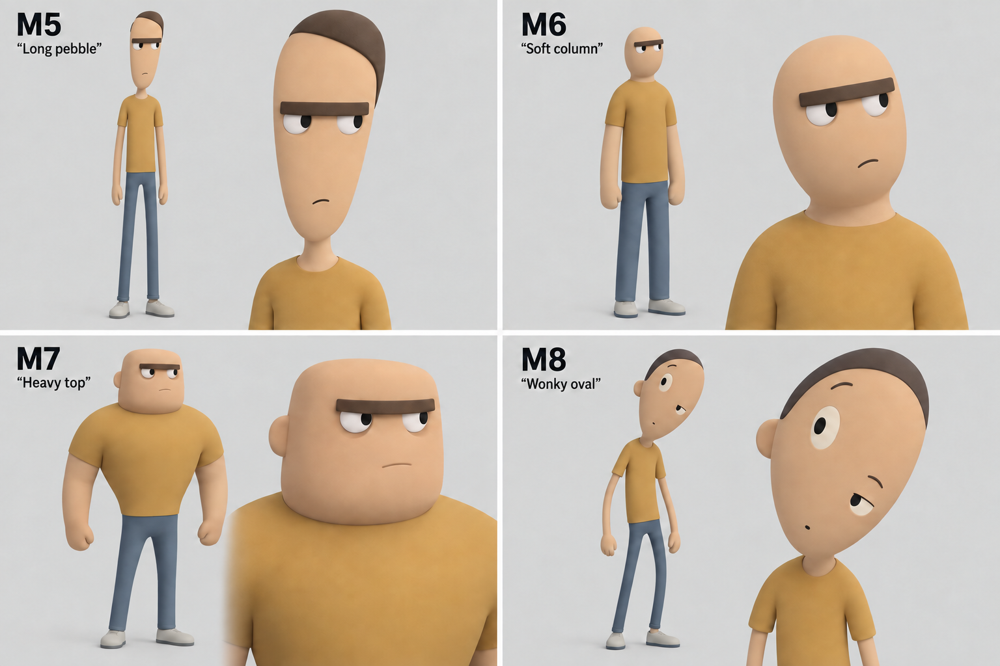

Created with built-in imagegen editing from the original M5-M8 sheet; [exact edit prompt](art-concepts/art03-mixtures-2-v2-prompt.txt). Visually checked the new brow/eyes in both full-body and head views, preserved silhouettes, complete bodies and readable labels. The enlarged heads show the mouth treatment most clearly. Concept direction is now approved. The earlier assistant shortlist below is superseded by the user's selection.

#### First 3D sample - proposed execution

The user said "OK continue please" after the recommendation to start with M5; M5 is therefore the first test, with M6 retained as an alternative. Prepare front/side/back views, build a simple static model, and review it at conversation distance in both the amber cell and cream/cool blue-grey shared spaces. Preserve the smooth simple volumes, sparse face and plain clothing; avoid adding realistic anatomy or fabric detail. The brow/eye/mouth construction should allow later expression changes. Rigging and idle/walk/talk motion follow a satisfactory static model test.

No Blender MCP tool is connected. A local check found no Blender executable on PATH or under `C:/Program Files/Blender Foundation`; this does not rule out a custom installation. Blender setup and export remain unverified.

#### M5 rig and motion previews - implemented, awaiting review

The user authorized continuing with mesh preparation and rigging. This authorizes implementation; the resulting appearance and motion are still **proposed**, pending review. The rig retains the selected M5 design and M7 face treatment.

Open `Assets/Scenes/Art03_M5_Rig.unity` and press **Play**. M5 idles in the common area. Open **Prison Game > Art > M5 Rig Preview** to switch between **Idle**, **Walk preview** and **Gesture preview**. Walk over to the inmate first, then press Escape to release the mouse for the preview buttons. These are Editor study controls.

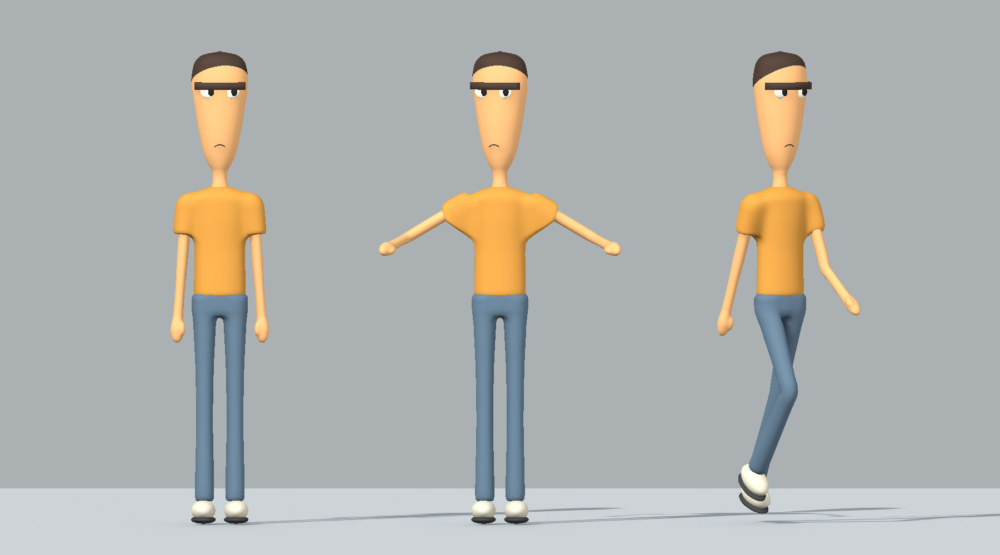

The left figure is neutral; the centre tests shoulder/elbow bends and head rotation; the right tests hip/knee bends. These are actual Unity renders of the deformed mesh, not generated concept art. [Common-area full body](images/art03/m5-rig-common-full.png), [common-area face](images/art03/m5-rig-common-face.png), [three-quarter face](images/art03/m5-rig-common-three-quarter.png), and [amber-cell face](images/art03/m5-rig-cell-face.png) show the rigged model in the selected lighting.

`Assets/Prototype/Art03Rig/M5_Rigged.prefab` uses a 17-bone skeleton and one skinned renderer with eight material slots. Face pieces follow the head without changing their spacing. The Animator defaults to a quiet four-second idle; a 1.2-second walk and 2.4-second nod/arm gesture are separate previews. The existing interaction and capsule collider remain on the parent inmate object.

**Initial rig-pass limits, before the polish below:** the walk ran in place and needed foot-contact polish before driving movement. The gesture was not triggered by talking. This custom generic rig has no lip sync, facial rig, navigation, root motion, humanoid retargeting or verified Blender export workflow. Geometry remains 29,037 vertices / 57,948 triangles, with no production retopology or UV layout. Joint deformation at larger angles still needs visual review. [Progress](progress.md#art-03-m5-rig-and-motion-previews--september-24) records that pass's verification.

#### M5 walk and talk integration - reviewed prototype

The user reviewed the integrated sample and asked only for slightly faster walking on September 24. M5's appearance and walk/talk behavior are accepted for this prototype. Increased travel speed by 20%, from 0.433333 to **0.52 m/s**, with walk playback at 1.2x the authored clip to preserve the stride. This is implemented in **`Assets/Scenes/Art03_M5_Behavior.unity`**; it does not approve final production topology or broader NPC routines.

Press **Play**, walk into the common area, aim at M5 and press **E**. M5 pauses, turns toward the player and gestures once, then idles for the rest of the six-second response. Pressing E again restarts that response/gesture. If a walk was requested, it resumes after the response.

For the movement test, press Escape to release the mouse and open **Prison Game > Art > M5 Rig Preview** in Unity's top menu bar. Use **Walk 1.2 m into common area**, **Walk back to start**, or **Stop walking**. M5 starts idle; the test buttons request actual movement rather than playing an in-place clip. Walking pace is 0.52 m/s, matched to faster clip playback. Walls, the player and missing floor support stop travel. Clearing an obstacle lets the requested walk continue.

| Runtime state | Actual Unity capture |
| --- | --- |
| Moving walk | [Walking](images/art03/m5-behavior-walking.png) |
| Talk-triggered gesture | [Talking](images/art03/m5-behavior-talking.png) |

The current movement follows a straight line on level ground. It cannot find a route around furniture or handle stairs/slopes. Turning is a simple stationary pivot without a turn animation. There is no daily routine, lip sync, persistence or economy. The study keeps movement/talking state separate from local player input and animation presentation; co-op is still unimplemented. [Progress](progress.md#art-03-m5-walk-and-talk-integration--september-24) owns verification and the next task.

This supersedes the unconnected-walk/gesture limits in the earlier stages below. Their scenes remain available for isolated comparisons.

#### M5 motion polish - implemented, awaiting review

The user authorized the next motion-polish pass. Appearance, pace and gesture remain **proposed** until reviewed. The same rig scene and preview controls now use the polished clips.

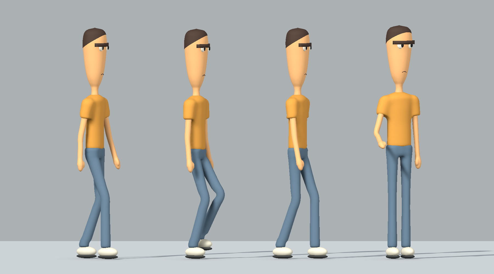

From left: walking at 0%, 25% and 50% of the cycle, then the gesture midpoint. The walk now places each sole flat during contact and lifts it about 6.5 cm during the returning step. Small pelvis movement keeps the knees from locking straight. Broader knee/elbow weights soften the bends, and the gesture uses a smaller elbow bend and restrained chest/head movement. These are actual rendered clip poses.

This supersedes the initial foot-contact limitation above: level-ground contact is now baked and verified, including between animation keys. The clip is designed for **0.43 m/s** forward travel at its normal playback speed. It still plays in place in the study, so contact feet move backward relative to the room. A moving character must match travel speed and playback to avoid sliding.

A small correction on the visual rig keeps soles above the floor during blends between clips; the largest measured lift was 7.8 mm. It leaves the parent inmate and collision unchanged. This supports the current flat study floor, not slopes, stairs or independent foot locking. The gesture still is not connected to E/talking; navigation, lip sync, retargeting and production topology remain unimplemented. [Progress and verification](progress.md#art-03-m5-motion-polish--september-24) own the checks. Proposed next step: connect the existing talk interaction to the gesture, then test the walk with matched actual travel; recommended reasoning mode **High**.

#### M5 refined static model - implemented, appearance awaiting review

At the user's request to proceed with refinement, created `Assets/Prototype/Art03Refined/M5_Refined.prefab` in `Assets/Scenes/Art03_M5_Refined.unity`. The shirt/sleeves, trousers/hips, head/neck and each arm/hand now have continuous surfaces. This removes the overlapping shoulder pieces, separate neck bead and protruding hip shape of the first study. The hair follows the smoothed head and the mouth is one curved mesh. M5's size, thin silhouette and selected facial style are retained.

Added a restrained material fill using URP Lit emission: the skin uses 12% of its linear base color, eyes 5%, most other surfaces 6%, and pupils zero. This raises the minimum brightness in shadow while retaining room-lit color and directional shading. It is a proposed character shading treatment, not an approved final renderer choice. These non-static renderers do not contribute baked illumination; room lights and ambient settings match the original study. A later art pass may replace this with a dedicated character shader if needed.

| Actual Unity view | First study | Refined study |
| --- | --- | --- |
| Neutral full body | [Before](images/art03/m5-studio.png) | [After](images/art03/m5-refined-studio.png) |
| Common-area full body | [Before](images/art03/m5-common-full.png) | [After](images/art03/m5-refined-common-full.png) |
| Common-area face | [Before](images/art03/m5-common-face.png) | [After](images/art03/m5-refined-common-face.png) |
| Common-area three-quarter | [Before](images/art03/m5-common-three-quarter.png) | [After](images/art03/m5-refined-common-three-quarter.png) |
| Amber-cell face | [Before](images/art03/m5-cell-face.png) | [After](images/art03/m5-refined-cell-face.png) |

Visually inspected the resulting shapes and face readability. The warm/cool difference remains visible; the refined face is brighter in shadow. These are actual Unity screenshots, with no AI repainting. The new body surfaces were generated from simple shape fields in Python and imported as native Unity meshes through MCP. Editable geometry sources are in `art-source/characters/m5/refined/`; this is not a Blender workflow.

The refined study has 57,948 triangles and 16 renderers, compared with the first study's 30,260 triangles and 32 renderers. Smoother joins came from rebuilding the surfaces; this is not a performance optimization claim. The new triangulated surfaces remain unoptimized, with no UV layout, rig, skin weights or animation. Review the static appearance, then prepare the mesh for clean bending at the shoulders/hips/elbows/knees before rigging and motion tests. The first study remains available below.

Open `Art03_M5_Refined`, press Play and Resume walking, then walk to the inmate in the common area and use E. All 26 existing interaction checks and saved-asset/lighting checks passed; [Progress](progress.md) owns the evidence.

#### M5 first static model - previous study

The [front/side/back reference](art-concepts/art03-m5-model-reference.png) was created with built-in imagegen using the selected sheet ([prompt](art-concepts/art03-m5-model-reference-prompt.txt)). The views are modeling guidance rather than an exact measured drawing; side/back details are proposed interpretations of the original image.

Built native Unity meshes and a reusable prefab at `Assets/Prototype/Art03/M5_Static.prefab`, placed on the existing interactable inmate in `Assets/Scenes/Art03_M5_Study.unity`. This is a separate copy of the combined lighting scene. Original scene assets remain intact. The study keeps the thin silhouette, pebble head, connected brow, white eyes, sparse mouth and plain clothes. Dimensions are provisional: approximately 1.96 m tall, 0.41 m wide, 0.21 m deep.

| Actual Unity render | Purpose |
| --- | --- |
| [Neutral studio](images/art03/m5-studio.png) | Judge the 3D shape separately from room lighting |
| [Common area full body](images/art03/m5-common-full.png) | First-person proportions |
| [Common area face](images/art03/m5-common-face.png) | Face at about 1 m, 1.7 m camera height, 70-degree vertical field of view |
| [Common area three-quarter](images/art03/m5-common-three-quarter.png) | Depth of brow, eyes and head |
| [Amber cell face](images/art03/m5-cell-face.png) | Same character under the warm lighting |

This is a rough static shape study, not the finished character. The shoulder/neck/hip joins and limb contours still look assembled; smoothing those transitions is the next modeling refinement. The face remains considerably darker under room lighting than in the concept image. Eye projection and sleeves were refined once after inspection; further shading and expression review remains. The meshes have no UV layout, skeleton or skin weights, and the 30,260 triangles across 32 renderers are not an optimized production target. Final topology and renderer/material batching need review before making a cast. No Blender import/export is claimed.

Open the study scene and press Play, then Resume walking. Walk into the common area and use E on the inmate. Technical verification and handoff are in [Progress](progress.md). Next: review/refine the static form and face lighting before rigging.

#### Original twelve-mixture comparison

Proposed September 24 in response to the latest clarification. These change head geometry, facial construction, silhouettes, and surface treatment. Consistent plain clothing makes the shape differences easier to compare. Influence names describe the intended mixture, not an exact reproduction or a measured blend.

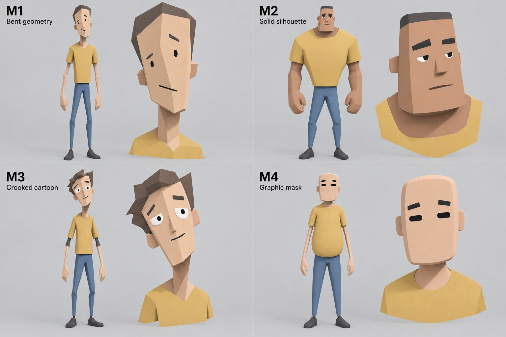

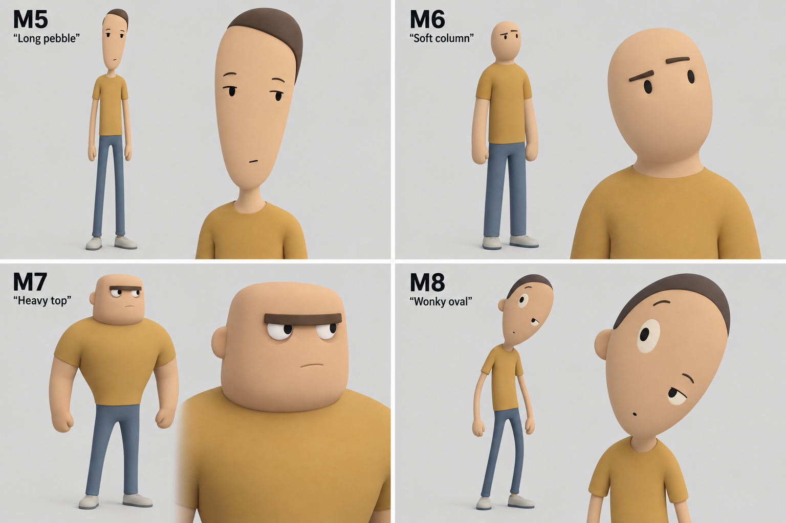

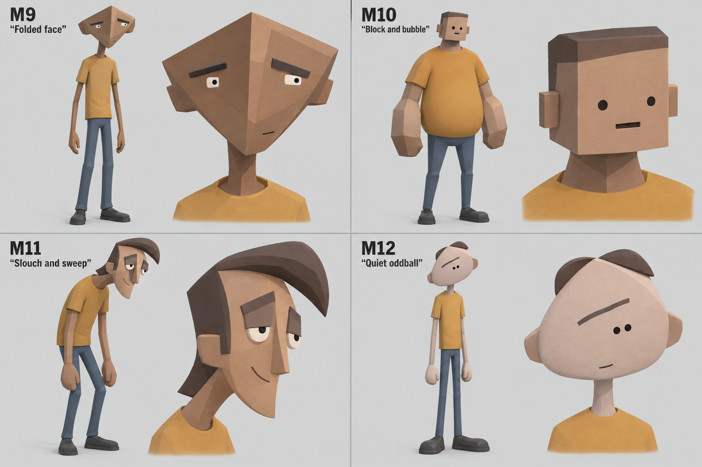

| ID | Proposed mixture | Main design difference |
| --- | --- | --- |
| M1 Bent geometry | Schedule I restraint + TABS planes | Bent pentagonal head, sparse face, narrow angular limbs |
| M2 Solid silhouette | Schedule I restraint + Team Fortress 2 shapes | Broad shoulders, small waist, block head, broad hands |
| M3 Crooked cartoon | TABS simplicity + Psychonauts eccentric geometry | Tilted face, uneven eyes, angular hair and limbs |
| M4 Graphic mask | PEAK face marks + Team Fortress 2 silhouette contrast | Flat pill eyes, rounded rectangular head, pear torso |
| M5 Long pebble | Schedule I slenderness + PEAK facial simplicity | Long smooth head, tiny dark eyes, almost no facial relief |
| M6 Soft column | Human: Fall Flat simplification + Schedule I adult height | Soft continuous forms, very small face, tube arms |
| M7 Heavy top | Gang Beasts round volumes + Team Fortress 2 proportions | Broad rounded upper body, narrow long legs, heavy brow |
| M8 Wonky oval | PEAK simple marks + Psychonauts asymmetry | Tilted oval head with strongly offset eyes |
| M9 Folded face | Schedule I restraint + Psychonauts angular geometry | Wide folded-kite head, tiny eyes, narrow body |
| M10 Block and bubble | TABS planes + Gang Beasts round core | Cuboid head and forearms against a rounded torso |
| M11 Slouch and sweep | Team Fortress 2 silhouettes + Psychonauts contour | Sloping posture, crescent face, swept hair, heavy lids |
| M12 Quiet oddball | Schedule I restraint + PEAK marks + Psychonauts asymmetry | Flat rounded triangular head, close-set dots, single long brow |

Built-in image generation, with text descriptions of the influences and no game images attached. Exact prompts: [sheet 1](art-concepts/art03-mixtures-1-prompt.txt), [sheet 2](art-concepts/art03-mixtures-2-prompt.txt), [sheet 3](art-concepts/art03-mixtures-3-prompt.txt). Sheet 1 subsequently received a [presentation-only edit](art-concepts/art03-mixtures-1-presentation-prompt.txt) to improve lighting and label contrast.

Visually inspected all twelve for full bodies, matching head studies, distinct features, and readable IDs. Material/shading differences are less pronounced than shape differences; these are illustrative concepts, not twelve validated rendering systems. M4/M6 omit a visible mouth; expression range needs refinement if selected. No mesh, rig, motion, or Unity appearance is verified. Suggested shortlist: M1, M9, M12 for sparse detail with stronger individual identity; M5 for the closest thin-figure option. This shortlist is a recommendation, not a user decision. Next: user selects two or three directions for refinement before 3D work.

See the [reference board](art-reference-board.md) for actual credited game imagery, including the broader Psychonauts and Team Fortress 2 references.

### ART-03 earlier exploration - Schedule I-centred styles

At the user's earlier request, this sheet returned to Schedule I's simple heads, thin limbs, readable eyes, and low surface detail. Four treatments of the same concept character are proposed: **A soft matte**, **B broad polygon planes**, **C clean toon shading**, **D muted paint**. A/D are intentionally subtle alternatives; B/C change the shading more visibly. None is approved or implemented as a game asset.

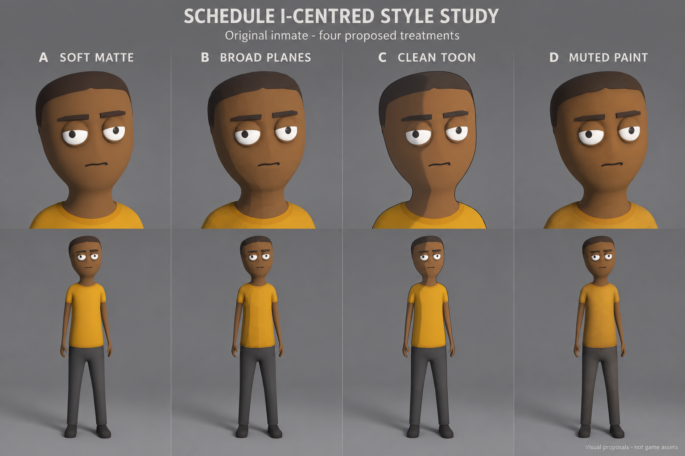

Created with built-in image generation using the existing credited Schedule I screenshot as a style/proportion reference. [Exact prompt](art-concepts/art03-schedule-style-v1-prompt.txt). Visually inspected for simple anatomy, broadly consistent identity/pose, readable labels, and full-body views. The hand shapes and shading are concept approximations, not a verified model specification. Compare these with the [real-game reference pictures](art-reference-board.md#d-similar-character-styles-in-existing-games---reference-only): TABS, PEAK, Human: Fall Flat, and Gang Beasts. Their similarities are visual assessments, not claims of identical style or adopted design decisions.

### ART-03 earlier exploration - V2 style alternatives

Latest request, September 24: the user wants to return to `art03-inmate-v2.png` and explore genuinely different cartoon visual styles rather than differently sized characters. They explicitly clarified that "animation" means style here, not movement. V2 is the renewed reference for exploration, not an approved final design. The earlier stick-like direction and V4 candidates are retained as prior iterations.

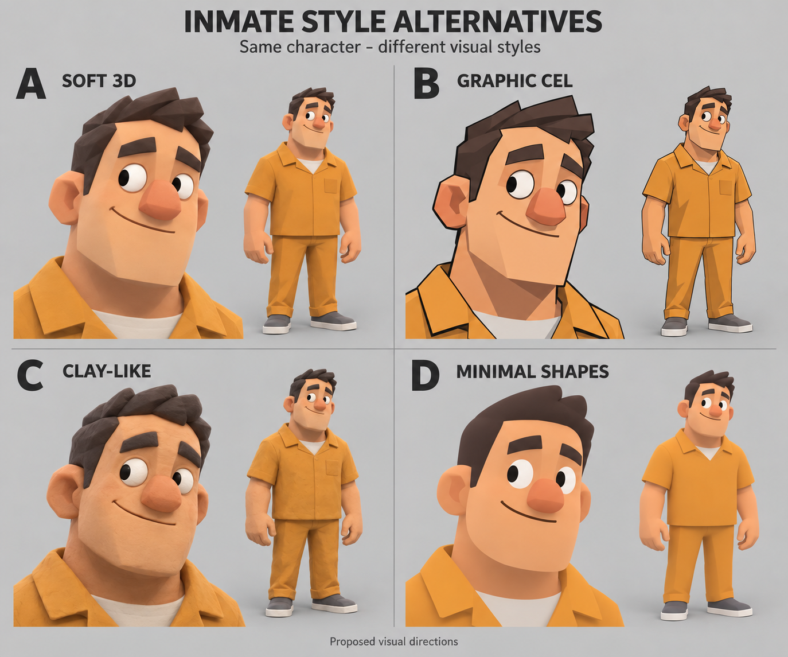

Current proposals, using V2's A character as a consistent identity and relaxed pose:

- **Style A - Soft 3D:** close to V2, with gentler shading and somewhat softened forms.
- **Style B - Graphic cel:** outlines and flatter, sharply separated light/shadow shapes.
- **Style C - Clay-like:** rounded handmade-looking forms with a matte clay texture.
- **Style D - Minimal shapes:** smooth broad forms with fewer clothing and facial details.

These A-D labels identify styles, not the earlier inmate candidates; removing V3 B/C does not exclude styles B/C here. Created with built-in image generation using V2 as reference; [exact prompt](art-concepts/art03-style-alternatives-v1-prompt.txt). Inspected for four readable labels, recognisable identity, complete bodies, and visibly different treatments. The generated proportions are broadly comparable, not metrically identical. All are visual proposals, not actual models, shaders, or animations. Next: user chooses/refines the visual style, then character variation and 3D workflow testing.

### ART-03 simplified concept sheet - previous exploration

Earlier review, September 24: the user removed V3's B and C and requested more variations. V4 kept A and D as candidates and added E/F/G/H. Retaining A/D was not final character approval. All six designs remain proposals; the latest request returns to V2 above.

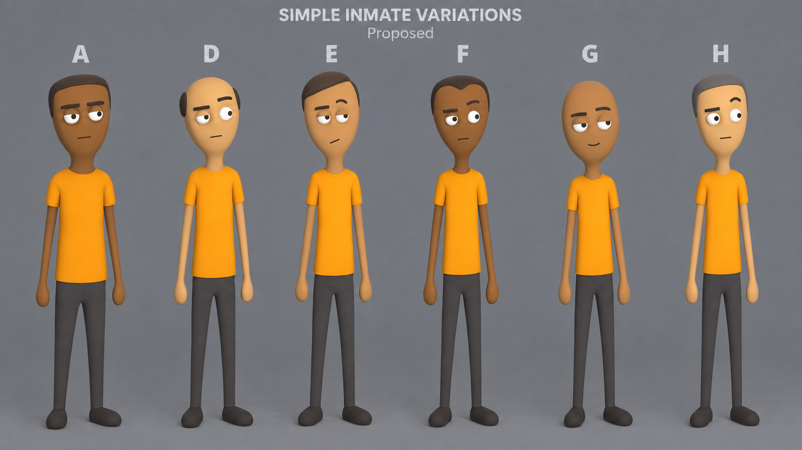

E has swept cap hair and a crooked mouth; F has a tapered head and shallow widow's peak; G is bald with sleepy eyes; H has grey cap hair and raised brows. All retain thin limbs and minimal clothing/face detail. Created with built-in image editing using V3; [exact V4 prompt](art-concepts/art03-inmate-v4-prompt.txt). Visually checked for removal of B/C, retention of A/D's designs, four new options, and full-body visibility. Next: user selects/refines the remaining candidates.

#### Previous V3 exploration

The user found V1/V2 too detailed and requested the "stick figure sort of design" seen in Schedule I. V3 responds with much thinner limbs, plain shirts/trousers, tiny mitten hands, and faces built primarily from eyes, brows, and a short mouth line. Generated using the existing Schedule I reference image for style/proportions. Specific proportions, faces, and clothing colours are still proposals.

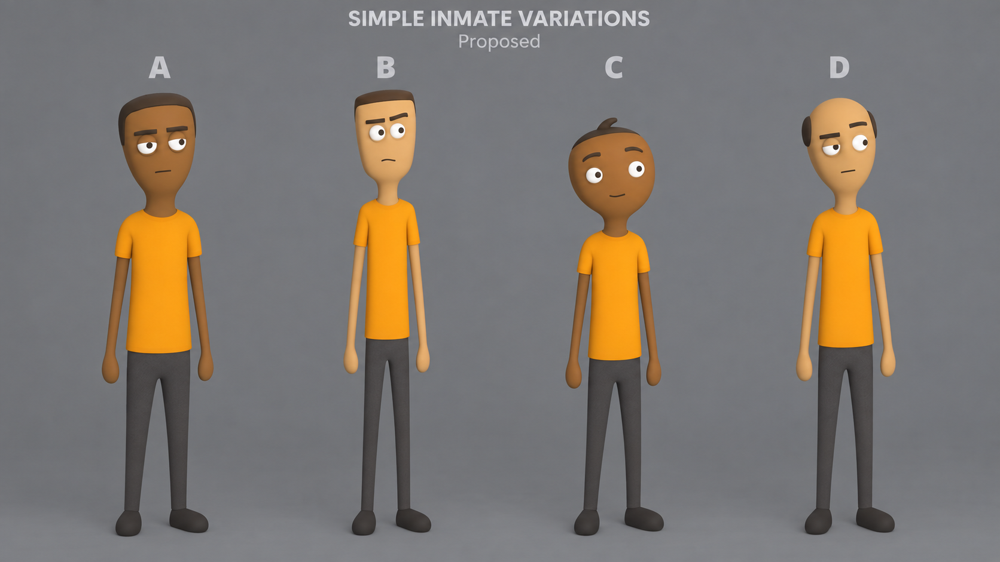

- **A:** elongated oval head and tired eyes; closest to the reference proportions.
- **B (removed by user):** longer rectangular head and more alert eyes; tall, thin body.
- **C (removed by user):** rounder head, wide-set eyes, small hair tuft; shorter thin body.
- **D:** tapered head, asymmetric eyelids, sparse side hair; long thin body.

Created with built-in image generation; [exact V3 prompt](art-concepts/art03-inmate-v3-prompt.txt). Visually inspected for simpler shapes, four labelled options, and full-body visibility. Choose/refine the design before model reference views and 3D creation. These are concept images, not meshes or verified in-game assets.

### ART-03 V2 reference and earlier concepts

Created September 24 with built-in image generation. The user initially found these too detailed, then returned to V2 to explore more varied alternatives. No faces, clothing, colours, body proportions, or faceted shading are finally approved. No names, backstories, or gameplay roles are assigned.

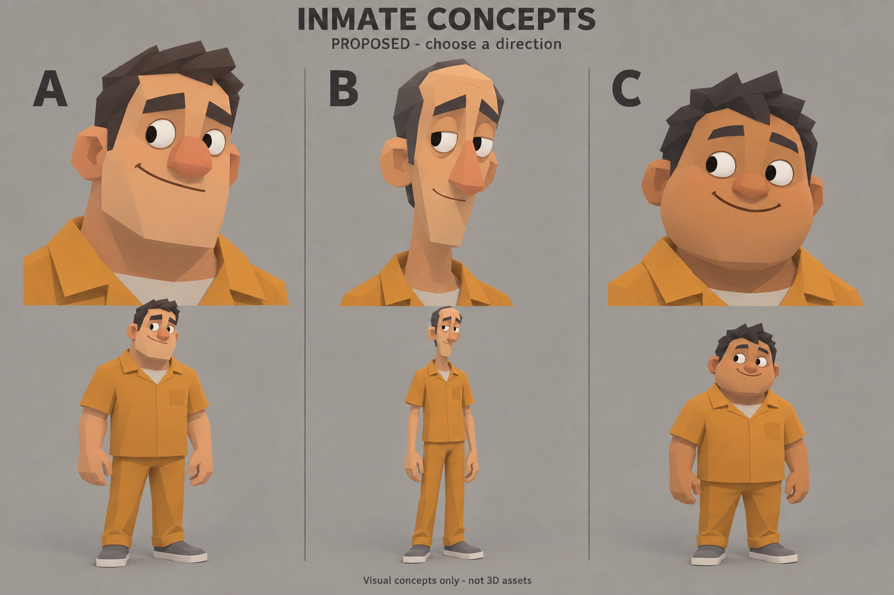

- **A:** broad head/build, rounded nose, uneven brows, amused expression.
- **B:** long head, lanky build, heavy eyelids, bemused expression.
- **C:** round head, shorter sturdy build, wide-set eyes, mischievous smile.

V2 simplified the first generation's surface detail. The user initially requested further simplification, which led to V3/V4; their latest request reopens V2 as a reference. Neither sheet is a mesh, rig, animation, or verified Unity rendering.

Generation record: [initial prompt](art-concepts/art03-inmate-v1-prompt.txt), [simplification prompt](art-concepts/art03-inmate-v2-prompt.txt). [V1](art-concepts/art03-inmate-v1.png) is retained as the input to the revision, not the current proposed rendering style. No external reference image was supplied to generation; V2 edited V1.

The user asked about Blender MCP for later work in the same project. A community [MCP for Blender](https://github.com/ahujasid/mcp-for-blender) supports object/material edits, scene inspection, and Python execution. Proposed workflow: keep Blender source assets in this game repository, export models to Unity, and test changes in the existing scene. Connection and export workflow remain unverified; no Blender tools are connected here, and the plugin-directory search returned no Blender plugin. No installation was performed. Speed gains need measuring on a small model/export test; usable deformation and visual quality still require review.

## Humor proposals

Use character behavior, petty disputes, bureaucracy, and contradictions in prison life. Examples:

- An inmate who treats his snack business like a luxury brand.
- A relentlessly cheerful announcement delivered during an inconvenient restriction.
- A guard who is meticulous about one minor rule and surprisingly relaxed about another.

Give characters motives and recurring habits so humor develops through familiarity. Stakes and consequences can be substantial, with clear feedback when they apply to the player.

As a presentation proposal, keep ordinary activity readable and calm. Use a consistent visual treatment for status, caution, and immediate danger, combining text and icons with color. Persistent effects need persistent indicators. Background faction changes can be conveyed through conversation or notices, but effects on the player's objectives must also be tracked clearly in the interface.

## Presentation checks

- Can the player recognize an important inmate at normal conversation distance?
- Can they distinguish an item they can use from background clutter?
- Does grime support the setting without obscuring the view?
- Do character behavior, dialogue, props, and announcements feel like the same world?

## Early art work - agreed approach, proposed assets

An art reference board is a small collection of labelled pictures showing candidate character proportions, prison interiors, lighting, colours, and interface treatment. Each reference should state what we want to borrow from its appearance and link to its source. It supports a visual decision; it is not a set of finished game assets or permission to copy another game's artwork. The [reference board](art-reference-board.md) contains five images. Its broad character, surface-detail, lighting-mood, and combined-interior direction is now agreed; ART-01 is complete. Specific designs, materials, colours, and interface styling still require review in the sample.

The user accepted developing a small art study alongside the playable prototype, followed by a polished integrated sample and broader production. Proposed initial assets are one inmate design, a cell corner, a few props, and a sample of the interface. Test proportions, materials, lighting, and readability from the actual first-person camera in the engine. A reusable wall section, door, bunk, table, and character body can establish the direction before producing many variations.

Keep the study easy to revise while room scale and interaction distances are being tested. Detailed production of the full prison and character cast follows a successful small integrated scene.

The current project uses Unity and URP. Blender for models remains a recommendation, not a confirmed selection. A similar cartoon appearance depends on shapes, materials, lighting, animation, and art direction. Choosing a render pipeline alone does not create the style. See [Development plan](development-plan.md) for the tool recommendation and source links.

The final asset workflow, animation approach, and exact level of geometric detail remain open. ART-03 now has concept artwork for review; no final character model or animation has been produced.

ROOM-01 uses temporary flat materials, two-tone walls, and box-built furniture for scale testing. These are implementation placeholders, not an approved visual style or a completed art study.

## HUD reference direction - September 25

**Agreed preference:** simple, to the point, comfy/sleek, with minimal obstruction of the world. The user wants task information to appear when appropriate and requested research before choosing the treatment. Exact layout, colors and visibility rules remain proposed; no HUD code changed in this research pass.

**References:** [Firewatch media](https://www.firewatchgame.com/media/) for restrained first-person interaction presentation; [A Short Hike official gallery](https://ashorthike.com/) and [UI screenshot gallery](https://interfaceingame.com/games/a-short-hike/) for approachable visual tone; [Guerrilla's HUD customization explanation](https://blog.playstation.com/2022/02/10/accessibility-features-in-horizon-forbidden-west/) for controlling what appears and when; [Sucker Punch's guiding-wind explanation](https://blog.playstation.com/2020/05/29/ghost-of-tsushima-your-questions-answered/) for guidance conveyed by the environment; [Sea of Thieves accessibility options](https://www.seaofthieves.com/accessibility) for configurable notification duration, text size and interaction-prompt placement. These are research references, not selected designs or imported game assets.

**Proposed treatment:** warm off-white text, muted sage/blue progress, a subtle dark backing for readability, small corner placement and gentle fades. Keep the centre clear for looking and interaction. Recommend Firewatch's restraint plus A Short Hike's approachable tone, using contextual visibility rather than permanent task paragraphs. Exact font and palette remain open.

### HUD variations - 01 Minimal text selected

User requested at least five variations following Schedule I's lightweight HUD reference. Five generated concept sheets each compare working and guard-warning presentation over the laundry scene:

1. [Minimal text](art-concepts/hud-v1/01-minimal-text.png): upper-left typography and work bar, separate timer.
2. [Soft card](art-concepts/hud-v1/02-soft-card.png): lower-left translucent card; warning replaces its contents.
3. [Bottom strip](art-concepts/hud-v1/03-bottom-strip.png): single horizontal bottom strip with consolidated information.
4. [Slim side panel](art-concepts/hud-v1/04-slim-side-panel.png): unboxed upper-right task stack.
5. [Duty badge](art-concepts/hud-v1/05-duty-badge.png): upper-left progress ring and compact badge.

**Agreed:** the user selected **01 Minimal text**. Use its lightweight upper-left task text/work bar, separate timer and clear centre as the visual direction. Other variants remain unselected. Exact typography, sizes and contextual transition timing still need in-game verification. These are AI-generated layout previews, not implemented Unity HUDs. The large sheet titles and frames sit outside gameplay; generated backgrounds/framing are not pixel-exact. Warning panels deliberately reuse the camera background for comparison. Some previews repeat the work percentage alongside the fraction; final implementation can remove redundant text. [Exact prompts and generation notes](art-concepts/hud-v1/prompts.md). Contextual fade/reveal behavior remains to be demonstrated in-engine after selection.

### Matching notification and inventory concepts - proposed

User requested styles matching selected HUD 01 and the eerily comfy/cozy, sleek, simple preference. Created three paired generated previews, ordinary pickup notice at left and inventory-open state at right:

- [A Quiet list](art-concepts/inventory-v1/a-quiet-list.png): bare lower-left pickup text; right-side inventory list over a localized dark gradient. Closest to 01.
- [B Warm panel](art-concepts/inventory-v1/b-warm-panel.png): small translucent notification capsule; comfortably spaced list inside a warm charcoal panel. Stronger background contrast.
- [C Compact grid](art-concepts/inventory-v1/c-compact-grid.png): item-icon notice with hairline accent; compact icon tiles for visual item recognition.

Recommend A's quiet notification with B's readable inventory backdrop, or all of A for the lightest visual treatment. All remain unselected. Contents, four sample pocket entries, icons and control hints are illustrative, not inventory-rule approvals. Inventory is proposed as on-demand only. Proposed ordinary notifications fade after roughly 2-3 seconds, combine repeated same-item additions, and never replace an active guard warning; warning and rare-result durations should be tested separately. Any sound cue should be soft and checked against the existing pickup sound to avoid doubling it. [Exact prompts and generation caveats](art-concepts/inventory-v1/prompts.md).

### Warm notification selection and provisional inventory

**Agreed:** user selected B Warm panel notifications. **Delegated provisional choice:** user allowed any inventory appearance for now and asked whether it could change later; use the matching B panel. HUD 01 remains selected. Presentation reads existing item state, so future layout changes need not alter ownership or save data. This does not approve new capacity, weight, stacking or pocket-eligibility rules.

September 25 inventory continuation: retained selected Minimal text HUD and B warm notifications. The provisional B-style inventory now shows six numbered carried slots, contextual item controls and the current favor; hold Tab to view. Capacity and item behavior are documented in Gameplay. Actual full-panel capture: [inventory01-panel.png](evidence/inventory01-panel.png). Layout remains replaceable and awaits user review.

September 25 user correction: conversations should respond faster and appear nearer the center. Duty01 now uses an immediate warm dialogue panel centered below the crosshair; ordinary pickup notifications remain a separate B-style presentation. Exact placement is provisional for play review. The neighboring cell reuses existing amber lighting, materials, bunk and desk style.
