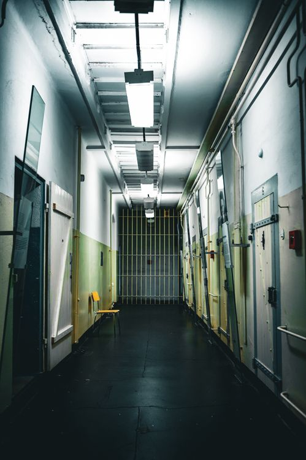
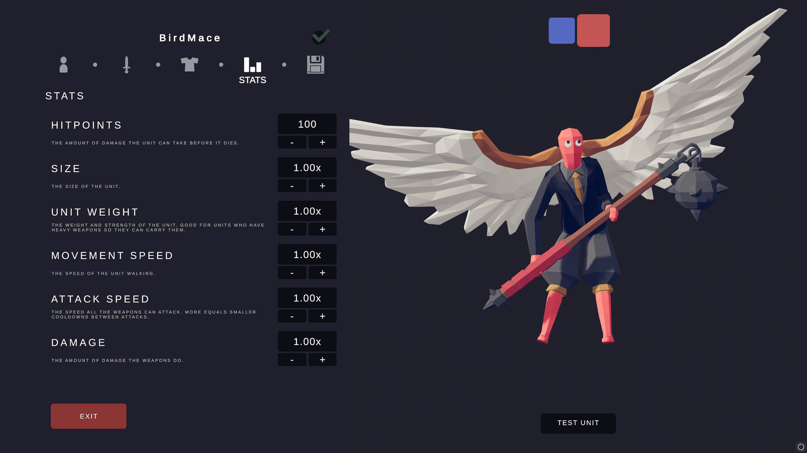
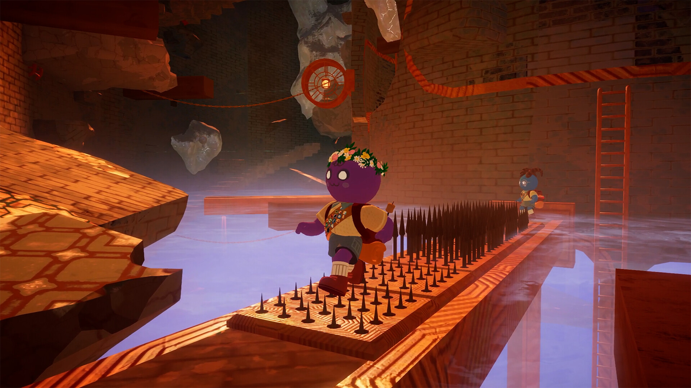
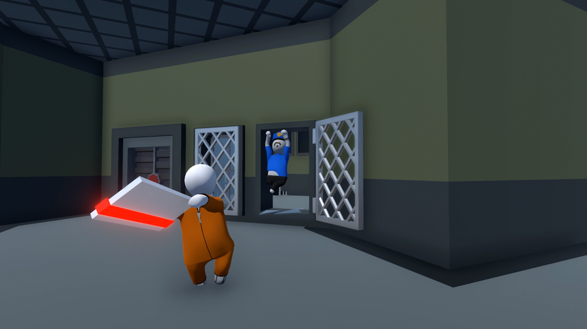
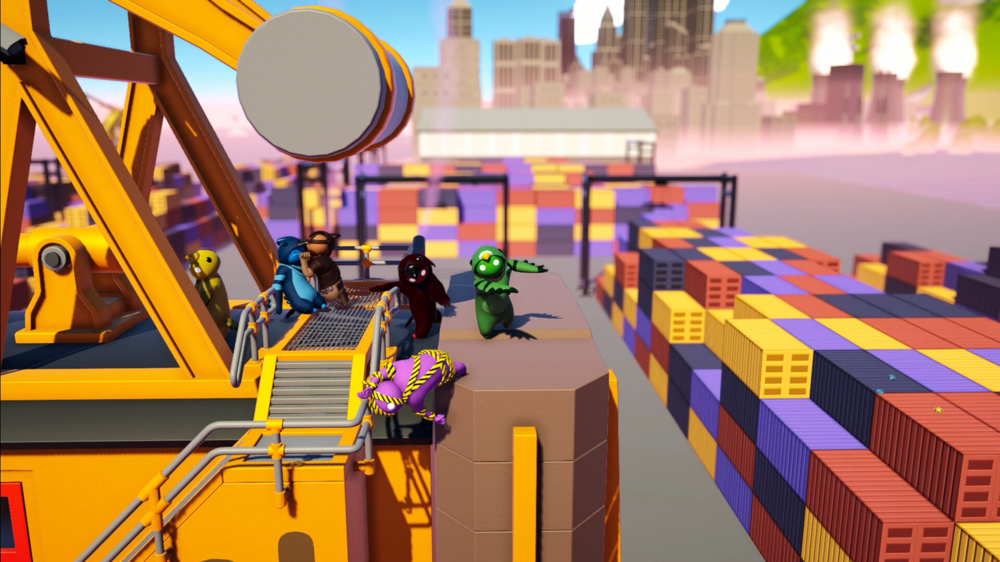
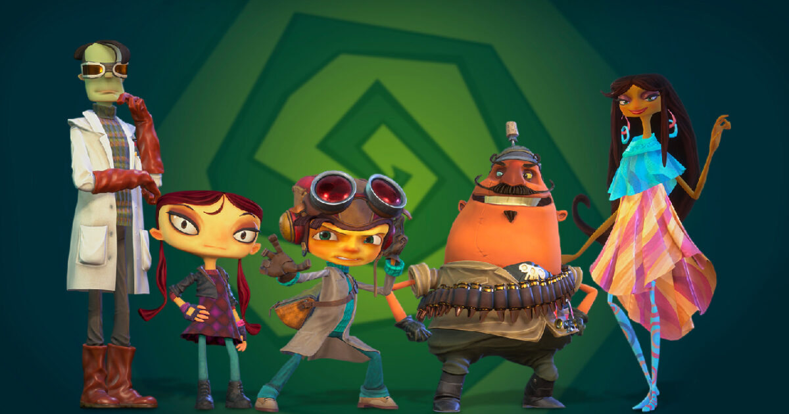
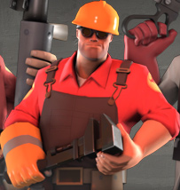

# ART-01 - first art reference board

**Status: broad direction agreed; ART-01 complete.** Updated September 23, 2026. Specific assets and lighting treatments will be reviewed in the next sample. Open this file in VS Code and press **Ctrl+Shift+V** to see the pictures.

Agreed starting point: simple cartoon appearance, slightly grimy prison, dark humor, eccentric characters, and clear first-person interaction. User feedback settled the character direction, sufficient surface-detail level, occasional dramatic lighting, and the B1/B2 combination. The usual lighting and interiors should feel "eerily cozy/comfy" while still feeling like a prison. Exact treatments need an in-game test. The images are design references stored in documentation. Owning decisions are in [Art and tone](art-and-tone.md#reference-board-decisions---agreed).

## A. Characters and dialogue

**Source:** Schedule I, TVGS, [official Steam gallery](https://store.steampowered.com/app/3164500/Schedule_I/). Original screenshot URL is in [the source list](art-references/steam-sources.json).

**Study:** a large, simple head; readable eyes and eyebrows; plain clothing shapes; short dialogue with clearly separated choices.

**Proposed application:** distinct head shapes, hair, brows, posture, and uniform fit would help distinguish inmates. Keep the important facial features visible from our usual conversation distance. Use clear dialogue text and readable choices when a conversation needs them.

**Agreed from your review:** proportions close to this, with funny, cute faces, but original designs rather than a direct copy. Our capsule inmate is still a placeholder. **Proposed execution:** develop our own head silhouettes, eye/brow shapes, noses, hair, and expressions within that level of exaggeration. The dialogue styling shown here remains a reference proposal; your approval concerned the characters.

## B. Prison architecture and everyday light

### B1. Tall, open block with daylight

**Source:** National Park Service / Dave Rauenbuehler, "Looking down Broadway in the Alcatraz Cellhouse," [Alcatraz Island](https://www.nps.gov/alca/index.htm). [Original image](https://www.nps.gov/common/uploads/structured_data/5482A294-DB42-56E0-FCCCD03C986AE1DC.jpg?maxHeight=800&maxWidth=1200&quality=90).

**Study:** repeated barred fronts, metal railings, cell numbers, painted masonry, and overhead daylight. The warm cell fronts and cooler walkway remain distinguishable.

**Proposed application:** simplify those shapes into reusable wall, door, and railing pieces. Keep everyday routes and faces well lit. Apply wear around hinges, handles, wall bases, and frequently touched edges. This photo supplies architectural details; our prison's era, geography, and final layout remain open.

### B2. Enclosed corridor with fluorescent fixtures

**Source:** Jasper Kortmann, [Corridor in Prison, Pexels](https://www.pexels.com/photo/corridor-in-prison-19526327/), photographed in Bautzen, Germany. [Downloaded image](https://images.pexels.com/photos/19526327/pexels-photo-19526327/free-photo-of-corridor-in-prison.jpeg?auto=compress&dpr=1&h=750&w=1260). Added for this comparison; reference use only.

**What I meant by enclosed:** a continuous ceiling close above the corridor, doors along solid walls, and visible overhead fixtures providing pools of light. B1 instead has an open space several storeys tall with daylight overhead. B2's photograph has cool tones and deep shadows; we can adjust colour and brightness independently of the architecture in our game.

| Choice | Features to compare | Possible application - proposed |
| --- | --- | --- |
| B1 | Tall space, visible tiers, daylight, longer views | Main shared block |
| B2 | Close ceiling, solid walls, overhead fixtures, shorter enclosed views | Cell corridor or service area |
| Combination | Different light and enclosure in different spaces | Open common area connected to more enclosed corridors |

**Agreed from your review:** the combination: an open common area connected to more enclosed corridors. The lighting and interior should usually feel "eerily cozy/comfy," with the prison setting still evident. Exact brightness, colours, ceiling treatment, and fixtures remain to be tested. These references do not change our approved prototype dimensions.

## C. Props and surface detail

**Source:** Schedule I, TVGS, [official Steam gallery](https://store.steampowered.com/app/3164500/Schedule_I/). Original screenshot URL is in [the source list](art-references/steam-sources.json).

**Study:** simple container shapes, large labels, a worn tabletop, and small variations in otherwise plain surfaces.

**Proposed application:** build a mug, parcel, toiletries, and bunk with clear shapes and restrained wear. Test each at the distance where the player actually uses it. Pick a few recognizable details for each object. Selection of a production or earning activity remains deferred.

**Agreed from your review:** Schedule I's level of surface detail is good enough, and extensive manual detailing is not a priority. **Proposed execution:** reuse materials/textures across props and room pieces, with a few shared wear treatments. A material needs initial setup, then it can serve many objects. Exact asset sources and tools are still open.

## D. Strong lighting accents

**Source:** Schedule I, TVGS, [official Steam gallery](https://store.steampowered.com/app/3164500/Schedule_I/). Original screenshot URL is in [the source list](art-references/steam-sources.json).

**Study:** local coloured light makes one area visually distinct; much of the surrounding room is in shadow.

**Agreed from your review:** occasional lighting this dramatic is welcome; you described its feeling as cozy and comfy. Your later clarification makes "eerily cozy/comfy" the usual atmosphere of the lighting and interiors as well. Occasional stronger accents can sit within that everyday mood.

**Proposed application:** try a personal lamp, a warmly lit cell corner, or a small area with stronger colour. Review it from the player camera so usable objects and faces remain readable. Specific fixtures, colours, locations, and frequency remain proposed.

## Proposed first sample after review

Make **one inmate and one cell corner** using the approved choices: a wall, barred door, bunk, small personal prop, and representative lighting. Put them in the running Unity scene and review them from the player camera. Interface styling can be tried on the existing interaction prompt at the same time.

Use the agreed funny/cute character direction, Schedule I-level surface detail, combined open/enclosed interiors, and usual "eerily cozy/comfy" atmosphere for that sample. Original character designs and the sample itself still need review.

**Current work:** lighting samples and the selected combined treatment are implemented; see [Progress](progress.md) for verification and remaining review. ART-03 now explores twelve original mixtures using Schedule I's simplicity and broader references. The user explicitly wants a unique appearance, not a literal Schedule I style. The reference-board choices do not approve a finished art sample on the user's behalf.

## D. Similar character styles in existing games - reference only

Added September 24 at the user's request. These are unmodified images downloaded from official Steam galleries, not generated examples. The similarities and differences below are our visual assessment; these games do not all have Schedule I's exact style. No additional game style is adopted without user selection.

### Totally Accurate Battle Simulator (TABS)

**Source:** Landfall, [official Steam gallery](https://store.steampowered.com/app/508440/Totally_Accurate_Battle_Simulator/).

**Useful similarity:** simple eye shapes, thin limbs, readable silhouettes, low facial detail. **Difference:** much more visibly faceted models and exaggerated fantasy clothing. Study the simple base figure; wings, weapons, and outfit are not proposals for our inmate. Closest of this selection for a more angular treatment.

### PEAK

**Source:** Team PEAK; publishers Aggro Crab / Evil Landfall?, [official Steam gallery](https://store.steampowered.com/app/3527290/PEAK/).

**Useful similarity:** personality from very few facial shapes and clear colour blocks. **Difference:** much shorter, rounder bodies and deliberately non-human skin colours. Useful for face simplicity, not a direct reference for our adult inmate proportions.

### Human: Fall Flat

**Source:** No Brakes Games / Curve Games, [official Steam gallery](https://store.steampowered.com/app/477160/Human_Fall_Flat/).

**Useful similarity:** simple smooth forms and minimal surface detail. **Difference:** more featureless faces and soft rounded bodies. This is a reference for how far anatomy can be simplified; our readable face requirement would still need eyes/brows and expression.

### Gang Beasts

**Source:** Boneloaf / Rocket Science; publisher Boneloaf, [official Steam gallery](https://store.steampowered.com/app/285900/Gang_Beasts/).

**Useful similarity:** few facial features, broad colours, very simple shapes. **Difference:** squat jelly-like bodies and costume-driven identities, further from Schedule I's lanky adults. Useful as a softer boundary comparison.

All inspected downloads and their original image URLs are recorded in [source manifest](art-references/character-styles/sources.json). Reference use only; images remain the respective owners' work. Download helper: `tools/fetch-character-references.py`.

### Psychonauts - broader shape reference

**Source:** Double Fine, [Help us make Psychonauts 2](https://www.doublefine.com/news/help-us-make-psychonauts-2). [Original image](https://assets.doublefine.com/shared/news/2020/_1200x630_crop_center-center_82_none/help-us-make-psy2.jpg?mtime=1647280764). Official promotional character art, not a gameplay screenshot.

**Visual assessment:** unusual head outlines, uneven facial features, and contrasting silhouettes offer a stronger departure from Schedule I. The surface and costume detail exceed our target; borrow selected shape ideas with much simpler clothing and materials. Proposed influence, not an adopted style.

### Team Fortress 2 - broader silhouette reference

**Source:** Valve, [official Team Fortress blog](https://www.teamfortress.com/post.php?id=2195). [Original image](https://steamcdn-a.akamaihd.net/apps/tf2/blog/images/blog_chars_engineer2.jpg). Small original character image, shown without AI reconstruction.

**Visual assessment:** strong shoulder/waist/limb contrasts and broad planes are useful for readable adult characters. Its anatomy, costume and equipment are more detailed than our target; those are not part of the proposed prison character designs.

## E. Earlier Schedule I-centred alternatives - proposed

This is a generated concept sheet, separate from the real-game images above. It holds the character design/pose broadly constant to compare rendering treatments: **A soft matte**, **B broad polygon planes**, **C clean toon shading**, **D muted painted surfaces**. A and D differ subtly; B and C are more visibly different. All retain thin limbs, simple faces, and minimal clothing detail. The exact design and treatment need user review. Owning decisions and [prompt](art-concepts/art03-schedule-style-v1-prompt.txt) are linked in [Art and tone](art-and-tone.md).

## F. Current twelve original mixtures - proposed

**Latest decision:** the user accepted the [revised M5-M8 sheet](art-concepts/art03-mixtures-2-v2.png), including M7's face style on M5/M6, with "ok lets go with this". This is the selected character style. Continuing with M5 produced [model reference views](art-concepts/art03-m5-model-reference.png), a [refined Unity study](images/art03/m5-refined-studio.png) with joined surfaces and brighter face shading, and now a [rigged model with pose tests](images/art03/m5-rig-poses.png) and idle/walk/gesture previews. The resulting appearance and motions await review. [Art and tone](art-and-tone.md#m5-rig-and-motion-previews---implemented-awaiting-review) owns review instructions and limitations.

The subsequent [motion-polish study](images/art03/m5-polished-motion.png) adds controlled foot contact, softer knee/elbow bending and a restrained gesture. These rendered poses and motions await user review; [review instructions](art-and-tone.md#m5-motion-polish---implemented-awaiting-review) describe the current limits.

The original comparison below broadened the character design itself, rather than just changing the same figure's shading. [Art and tone](art-and-tone.md#art-03-current-exploration---twelve-original-style-mixtures) owns the full mixture table, prompts, limitations, and selection status. These original sheets are retained as exploration history; the revised M5-M8 sheet above is the selected direction.

