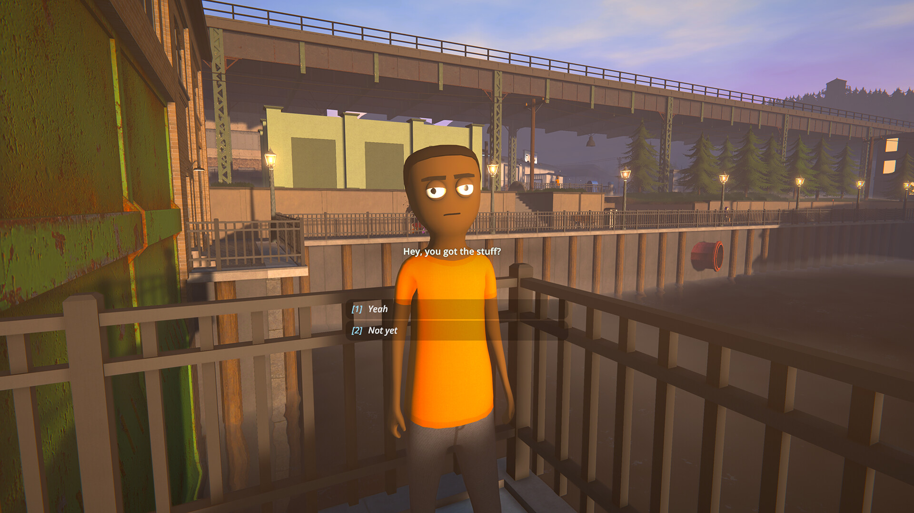
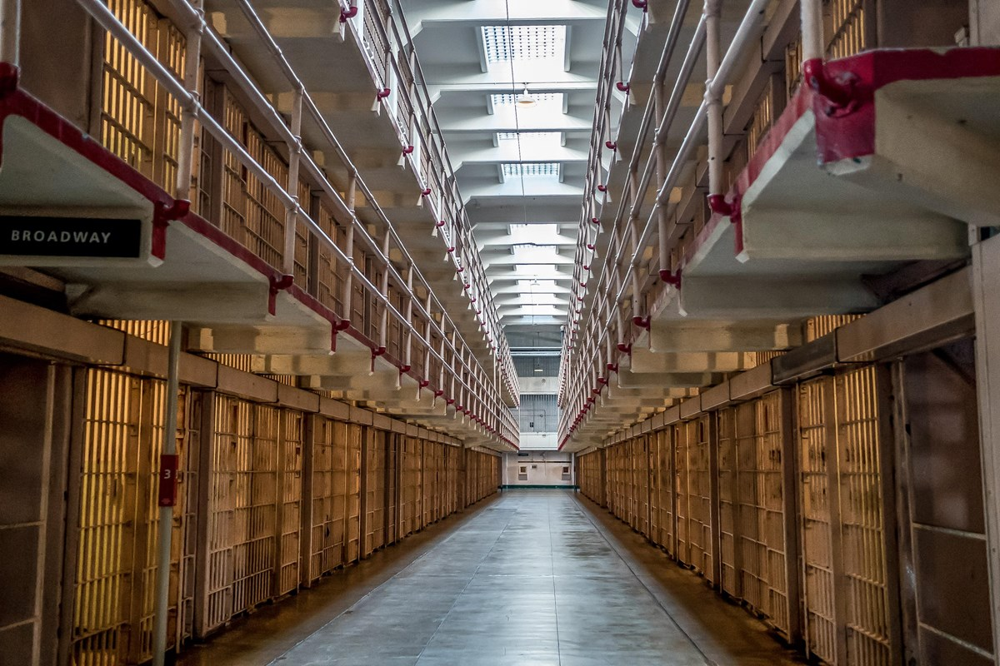
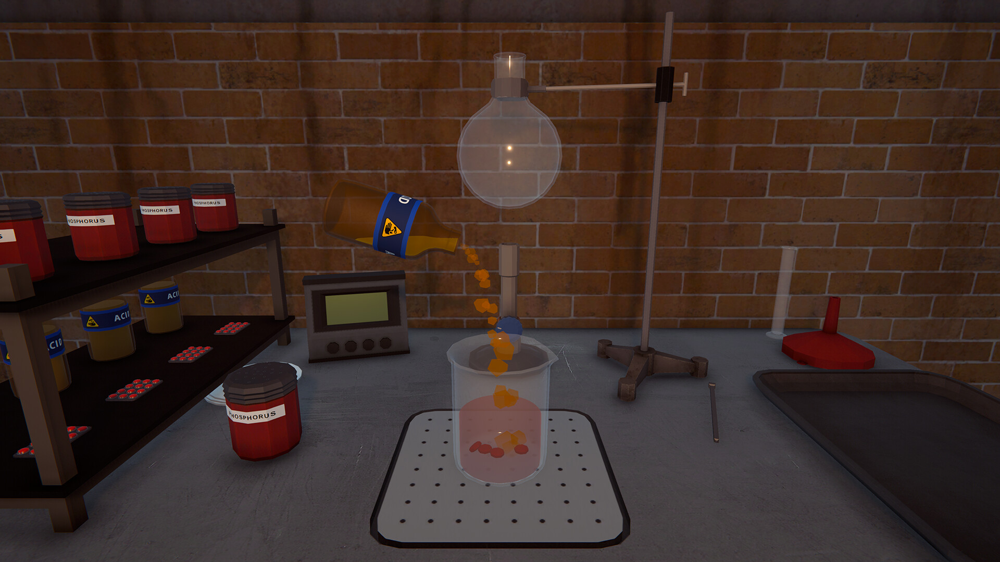
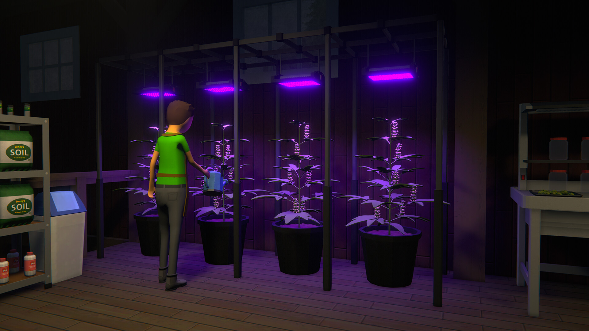

# ART-01 - first art reference board

**Status: proposed; needs your review.** Prepared September 23, 2026. Open this file in VS Code and press **Ctrl+Shift+V** to see the pictures.

Agreed starting point: simple cartoon appearance, slightly grimy prison, dark humor, eccentric characters, and clear first-person interaction. Specific proportions, lighting, colours, and materials below are suggestions. The images are design references; they are stored in documentation and have not been imported as game assets.

## A. Characters and dialogue

**Source:** Schedule I, TVGS, [official Steam gallery](https://store.steampowered.com/app/3164500/Schedule_I/). Original screenshot URL is in [the source list](art-references/steam-sources.json).

**Study:** a large, simple head; readable eyes and eyebrows; plain clothing shapes; short dialogue with clearly separated choices.

**Proposed application:** distinct head shapes, hair, brows, posture, and uniform fit would help distinguish inmates. Keep the important facial features visible from our usual conversation distance. Use clear dialogue text and readable choices when a conversation needs them.

**Your review:** are these proportions close to what you want, or should our characters have less exaggerated heads and eyes? Our current capsule inmate is only a placeholder.

## B. Prison architecture and everyday light

**Source:** National Park Service / Dave Rauenbuehler, "Looking down Broadway in the Alcatraz Cellhouse," [Alcatraz Island](https://www.nps.gov/alca/index.htm). [Original image](https://www.nps.gov/common/uploads/structured_data/5482A294-DB42-56E0-FCCCD03C986AE1DC.jpg?maxHeight=800&maxWidth=1200&quality=90).

**Study:** repeated barred fronts, metal railings, cell numbers, painted masonry, and overhead daylight. The warm cell fronts and cooler walkway remain distinguishable.

**Proposed application:** simplify those shapes into reusable wall, door, and railing pieces. Keep everyday routes and faces well lit. Apply wear around hinges, handles, wall bases, and frequently touched edges. This photo supplies architectural details; our prison's era, geography, and final layout remain open.

**Your review:** does this bright institutional interior fit, or do you prefer a more enclosed, fluorescent-lit block? The reference's scale does not change our approved prototype dimensions.

## C. Props and surface detail

**Source:** Schedule I, TVGS, [official Steam gallery](https://store.steampowered.com/app/3164500/Schedule_I/). Original screenshot URL is in [the source list](art-references/steam-sources.json).

**Study:** simple container shapes, large labels, a worn tabletop, and small variations in otherwise plain surfaces.

**Proposed application:** build a mug, parcel, toiletries, and bunk with clear shapes and restrained wear. Test each at the distance where the player actually uses it. Pick a few recognizable details for each object. Selection of a production or earning activity remains deferred.

**Your review:** how much surface detail do you want: mostly flat colours with a little wear, or visibly textured surfaces like this example?

## D. Strong lighting accents

**Source:** Schedule I, TVGS, [official Steam gallery](https://store.steampowered.com/app/3164500/Schedule_I/). Original screenshot URL is in [the source list](art-references/steam-sources.json).

**Study:** local coloured light makes one area visually distinct; much of the surrounding room is in shadow.

**Proposed application:** occasional distinctive lighting can make particular places recognizable. For everyday prison activity, my recommendation is the visibility in B, with softer local accents. Ordinary faces, doors, and handled objects should stay easy to see.

**Your review:** would you enjoy occasional lighting this dramatic, or prefer gentler differences throughout the prison?

## Proposed first sample after review

Make **one inmate and one cell corner** using the approved choices: a wall, barred door, bunk, small personal prop, and representative lighting. Put them in the running Unity scene and review them from the player camera. Interface styling can be tried on the existing interaction prompt at the same time.

My starting combination is A's simple readable characters, B's institutional architecture and everyday visibility, and C's recognizable props with selective wear. D is an optional accent reference. These selections remain proposed until you choose.

You can respond one piece at a time: **"A: keep the simple faces, smaller eyes. B: brighter. C: less texture."** Start with A if that is easiest. We then record your choices in [Art and tone](art-and-tone.md), revise this board, and create the small sample. No new software or finished asset purchases are needed to review these pictures.
